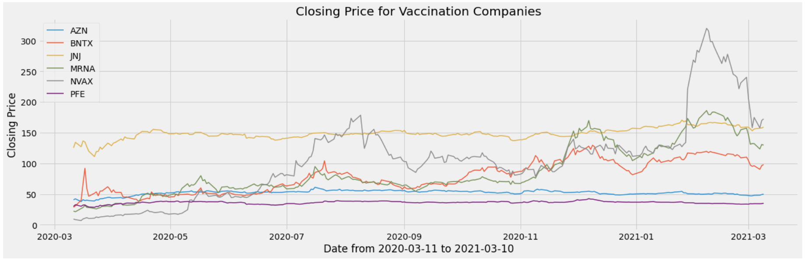
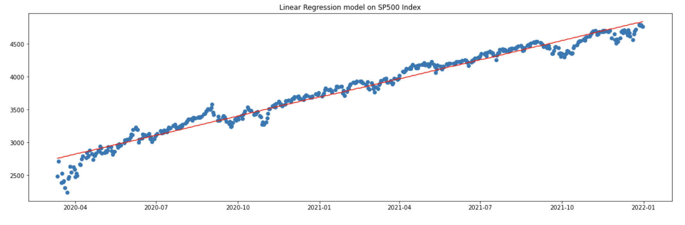
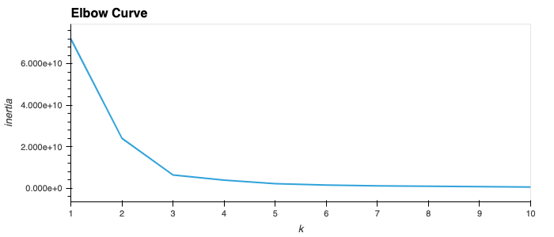
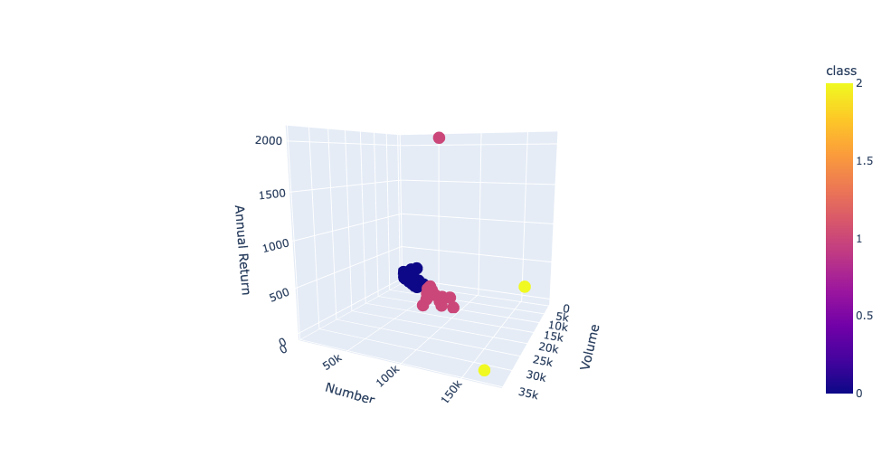
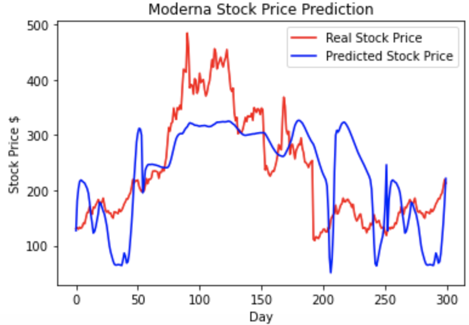
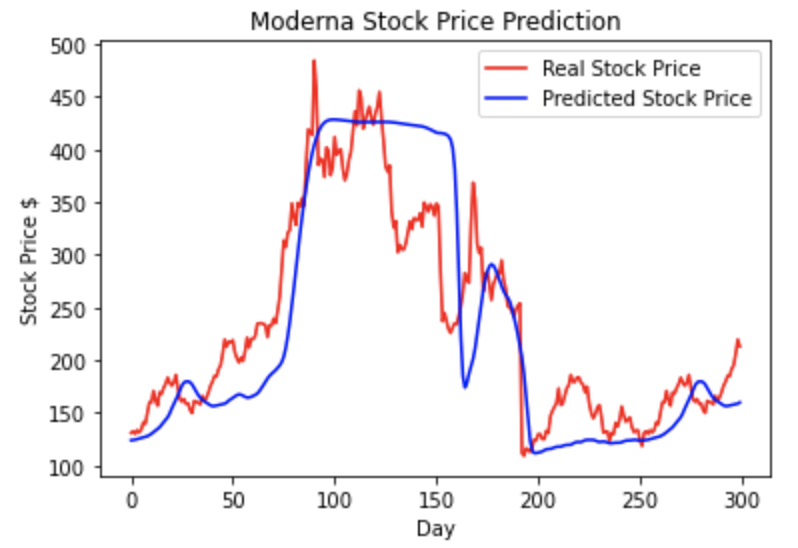

# Analyzing effects of the Pandemic on Stock Market

## Overall
The project is about comparing stocks from companies who produce vaccines and the health care sector in general.
We want to see if the stock from COVID 19 producers is doing better than the health care sector. In general, we look for how healthcare choices are doing good and in which area in the pandemic. We get data from Kaggle for COVID companies' vaccines from their stock data which has four columns of prices: Open, High, Low, Close. We focus on looking at Close price. We may create new columns from these basic four columns of data if needed.
Especially for Machine Learning, when the database is clean, and brings more insight information, we will decide more columns to cluster, and learn further from the cluster.

[Google Slide](https://docs.google.com/presentation/d/1oSJ2avPSx7_tLzqk5HBagGbbpPnChRv1a3u5FSAFNd8/edit#slide=id.g10f44ae38ac_2_62)

## Git Repository
In Git, the repository is like a data structure used by VCS to store metadata for a set of files and directories. It contains the collection of the files as well as the history of changes made to those files. Repository in Git is considered as your project folder. A repository has all the project-related data.
 
Our Git Repository is called the Final_Project which has 4 branches & a README. 
1. git-master
2. ml-master
3. db-master
4. tech-master
5. README

These are the branches where all our works are going to stored & made accessible to rest of the team members. The README is the one which will have all the written report of the entire analysis.

## Technologies Used
We collect data from csv. The Database in charge  will try to look at it, learn columns, and first visualize data on jupyter lab, and Panda for programming. 
Then use PostgreSQL for the database after learning and shaping clean data. The Machine learning will use unsupervised tool to run prediction for data. 

## Database Storage
We use PostgreSQL as our database to store clean and dependent datasets. We will use Tableau and integrate Flask to display the data.

#### Datasets
We acquired data from multiple sources, including data acquired from polygon.io using API, existing datasets from Kaggle, and SP500 data package in python from datahub.io, etc. 

To get data of individual stocks data, we first aquired the list of stocks in the SP500 through [datahub.io](https://datahub.io/core/s-and-p-500-companies#resource-s-and-p-500-companies_zip) and subseted the health sector.
Using for-loop to iterate through the health sector list, we created polygon.io API links [example] (https://api.polygon.io/v2/aggs/ticker/EDIT/range/1/day/2020-03-12/2021-12-31?adjusted=true&sort=asc&limit=730&apiKey=3KpZPDXRUCksP8Xb5AJKkXI02s8x5VXx) for each stock in the sector, date ranging from 03-12-2020 to 12-31-2021, extracted the results and created dataframe **SP500 health sector stocks all**.

The companies producing covid vaccines were further derived from the dataframe into a separate dataframe **COVID companies stocks**.

All related code has been updated in GitHub. 

Data sources include:

- SP500 by sector
- SP500 health sector stocks all 
- COVID companies stocks
- [COVID datasets](https://www.kaggle.com/josephassaker/covid19-global-dataset)

#### Data Cleaning
Data cleaning was performed to include ticker, daily open, close, highest, lowest price, etc, from the start of the stock meltdown in 2020 (03-12-2020) to end of 2021 (12-31-2021) for each SP500 sector and each stocks in the healthcare sector. Headers were added (if needed) and date was formated.

#### Creating Dataset

We uploaded source data to postgreSQL database. To create ideal datasets for further analysis:

 - We subsetted the COVID data into US only and the date was set as the primary key;
 - The COVID companies stocks was joined with COVID data into one dataset: **COVID stock covid data**;
 - The closing price of all the 12 SP500 sector index data were joined together with COVID data into one dataset:  **SPX sector covid data**;
 - The SQL query was uploaded to GitHub; 
 - Schema for both datasets were created, see following.

#### Interactive Tableau Dashboard
The datasets will be displayed on interactive dashboards on Tableau. 
[Tableau Storyboard](https://public.tableau.com/app/profile/lexy5077/viz/Final_Project_16430117700110/FinalProject?publish=yes)

#### Schema 

##### **COVID stock covid data**

##### **SPX sector covid data**
###### _Due to the free version of databasediagrams, maximun of 10 diagrams were allowed, thus, some of the index diagrams were not shown_

#### Creating an AWS Relational Database
AWS offers a wide variety of storage options on its platform, including both structured and unstructured databases. We'll be setting up a Postgres database using AWS's relational database service (RDS). The Postgres database we just created is hosted on the cloud, so it can be accessed by fellow team members with credentials using whatever platform they prefer.

## Provisional machine learning model: 
There are a couple options when it comes to machine learning. Depending on the available dataset we have, our project can, potentially, proceed in two different directions:
### Supervised ML - Linear Regression Forecasting 

Our model will be based on the historical record of closed prices for vaccination companies. We find the closed prices are continous variables thus it is better to utilize linear regression to predict trend lines. The general idea is to set "Time" in the x-axis and "Closeing Price" in the y-axis. What we expect to see is each stock should have a pattern and the pattern will be continuous. If the pattern is volatile, regression may not be a good terminology to predict.

Overview of vaccination stocks:

With linear regression model to predict overall market performance and target health sector performance, they looks similar. Then we focus on covid companies and compare them with the market. As we said before, if some good or bad news come out, it might affect stocks to one side extremely. What we see in the six covid companies, they performed similar to the market. But started from the last half year, the volatility kick in. It limited the regression model to well predict.

Overview of SP500 index prediction.

### Unsupervised ML - K-Nearest Neighbors Algorithm Clusterings
Uncertain if we’ll have enough features/columns for the algorithm to run. 
We know the model can't have strings, so we have to transform strings into number. We decide to name sector a number, and calculate the annual return for each stock. The goal here is we use unsupervised ML to cluster high, medium and low return based on the benchmark (SPY). Then we will check how many stocks in the same cluster belong to the same sector.

By diving into a specific timeframe, for instance  2000 - 2019 (pre-pandemic). We can train models with supervised ML, graph out the predicted data points with dashlines, and analyze its performance vs model predictions. 

We can perform ML on specific companies, or Nasdaq Healthcare index, or whichever makes lives easier, simpler, and happier. (ha!)

When we process the data, we found the date is from 2020-03-11 to 2021-12-31. So we should reorganize the date from 2020-03-11 to 2021-03-11 to calculate annual return. Then we focus on the stocks from health sector and see if covid companies are outperforme others. We select three features here. Annual return is the key factor to check the performance. Number of transactions and volumes support price movements if the stocks are popular during these periods. And we also test how many clusters we need by using Elbow Curve. But the results seem most companies perform closely to each other. There might be one reason that covid companies were volatile in the last half year. It might reduced their leading performance back to average level.

Elbow Curve is utilized in order to identify the ideal number of clusters in the dataset. 

Elbow Curve: [Click me to understand more about Elbow Method](https://en.wikipedia.org/wiki/Elbow_method_(clustering))

Clustering in 3D view:

### Recurrent Neural Network (RNN) in Predicting MRNA Stock Price

In correlation analysis we notice the daily COVID cases are correlated with vaccine company stocks, like Moderna (MRNA), thus we are wondering whether we can use the closing price and covid data to predict future stock price of MRNA.

To predict the continuous variable like stock price, we used Recurrent Neural Network (RNN). We separate the data into two parts - training and testing. We first used the 60 days closing price data to predict the closing of day 61 for the 10 months in 2020. And tested the model usinsg 2021 data and predicted the stock closing price from Mar 2021 - Dec 2021. The graph showed moderate success trend in predicting closing price.

Next, using the same Recurrent Neural Network (RNN), with not only closing price of the 60 days data, but also two more variables related to daily covid data (cases and deaths), we retrain the RNN model to predict the closing price of day 61. The model showed increasing success in predicting closing price.

